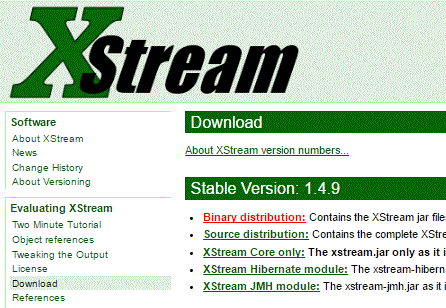

# :tada: XML com Java :tada:

XML com Java, utilizando a biblioteca [XStream][site-xstream].

## :memo: Licença
Esse projeto está sob a licença MIT. Veja o arquivo [LICENSE](LICENSE) para mais detalhes.

[site-xstream]: https://x-stream.github.io
